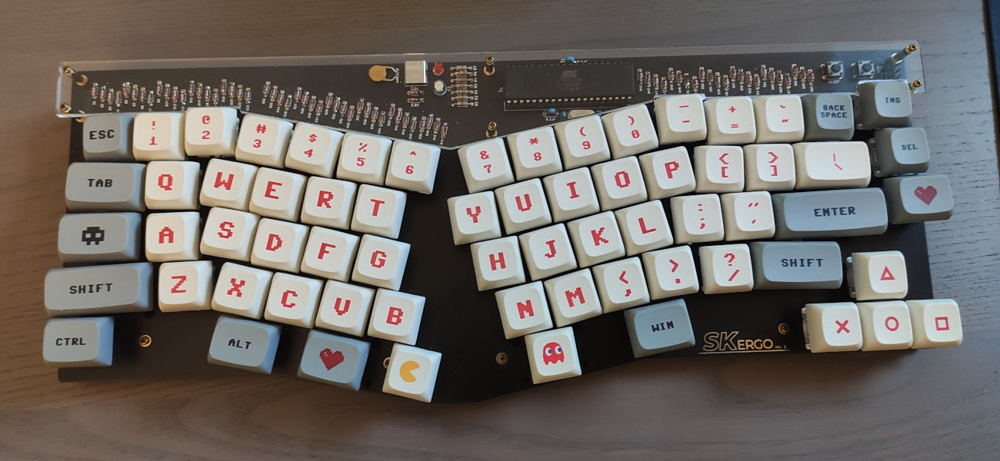

## SK Ergo

 - US Setting
 - The 2 central small keys are spacebars, the heart below V switches to layer 1
 - Layer 1: Makros for german umlauts using CapsLock as compose key; F1..F12 on numbers; PageUp/Down Home and End on Cursor Keys
 - Keys: Gateron Red
 - Keycaps: XDA Profile, forgot its name...
